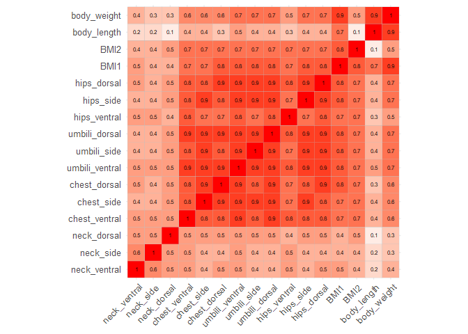
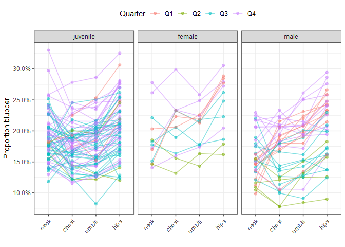
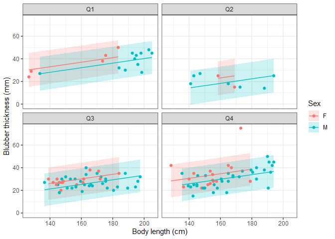
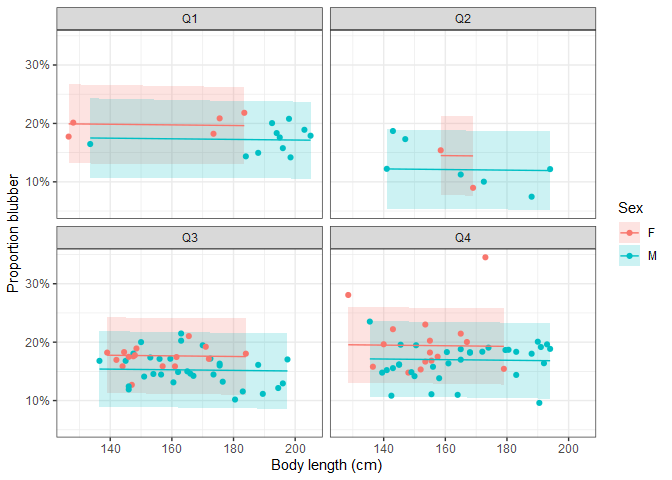
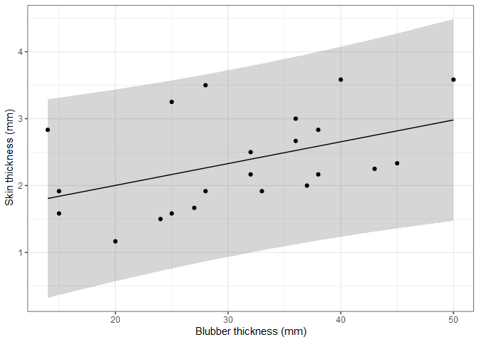

Measurement of the blubber layer at different sites in Baltic grey seals
================

This repository contains code for reproducing figures and tables.

``` r
library(tidyverse)
source("R/functions.R")
```

### Figure 3

``` r
read_blubber() %>% 
  select(starts_with("blubber"), BMI1, BMI2, body_length, body_weight) %>% 
  rename_with(~str_remove(.x, "blubber_")) %>% 
  na.omit() %>% 
  cor() %>% 
  ggcorrplot::ggcorrplot(lab = TRUE, digits = 1, lab_size = 2, show.legend = FALSE, tl.cex = 10)
```

<!-- -->

### Figure 4

``` r
read_blubber() %>% 
  blubber_ratio() %>% 
  select(starts_with("blubber"), BMI1, BMI2, body_length, body_weight) %>% 
  rename_with(~str_remove(.x, "blubber_")) %>% 
  na.omit() %>% 
  cor() %>% 
  ggcorrplot::ggcorrplot(lab = TRUE, digits = 1, lab_size = 2, show.legend = FALSE, tl.cex = 10)
```

<!-- -->

### Figure 5

``` r
read_blubber() %>% 
  longer_blubber() %>% 
  group_by(accnr, pos1, quarter, group) %>% 
  summarise(value = mean(value), .groups = "drop") %>% 
  ggplot(aes(x = pos1, y = value, color = quarter)) + 
  geom_path(aes(group = accnr), alpha = .5) +
  geom_point(alpha = .5) + 
  theme_bw() +
  facet_wrap(~group) +
  xlab("") + ylab("Blubber thickness (mm)") +
  theme(legend.position = "top", axis.text.x = element_text(angle = 45, hjust = 1)) +
  labs(color = "Quarter")
```

<!-- -->

### Figure 6

``` r
read_blubber() %>% blubber_ratio() %>% 
  longer_blubber() %>% 
  group_by(accnr, pos1, quarter, group) %>% 
  summarise(value = mean(value), .groups = "drop") %>% 
  ggplot(aes(x = pos1, y = value, color = quarter)) + 
  geom_path(aes(group = accnr), alpha = .5) +
  geom_point(alpha = .5) + 
  theme_bw() +
  facet_wrap(~group) +
  theme(legend.position = "top", axis.text.x = element_text(angle = 45, hjust = 1)) +
  xlab("") + ylab("Proportion blubber") + 
  scale_y_continuous(labels = scales::percent_format()) + 
  labs(color = "Quarter")
```

<!-- -->

### Figure 7

``` r
# Fit linear model to blubber thickness
linear_fit1 <- read_blubber() %>% 
  longer_blubber() %>% 
  filter(pos1 == "chest", pos2 == "ventral") %>% 
  lm(value ~ quarter + body_length + sex, data = .)

broom::augment(linear_fit1, interval = "pred") %>% 
  ggplot(aes(x = body_length, color = sex)) + 
  geom_ribbon(aes(ymax = .upper, ymin = .lower, fill = sex), alpha = .2, color = NA) +
  geom_point(aes(y = value)) +
  geom_line(aes(y = .fitted)) + 
  facet_wrap(~quarter) + 
  theme_bw() + 
  xlab("Body length (cm)") + ylab("Blubber thickness (mm)") +
  labs(color = "Sex", fill = "Sex")
```

<!-- -->

### Figure 8

``` r
# Fit linear model to proportion blubber
linear_fit2 <- read_blubber() %>% 
  blubber_ratio() %>% 
  longer_blubber() %>% 
  filter(pos1 == "chest", pos2 == "ventral") %>% 
  lm(value ~ quarter + body_length + sex, data = .)

broom::augment(linear_fit2, interval = "pred") %>% 
  ggplot(aes(x = body_length, color = sex)) + 
  geom_ribbon(aes(ymax = .upper, ymin = .lower, fill = sex), alpha = .2, color = NA) +
  geom_point(aes(y = value)) +
  geom_line(aes(y = .fitted)) + 
  facet_wrap(~quarter) + 
  theme_bw() + 
  xlab("Body length (cm)") + ylab("Proportion blubber") +
  labs(color = "Sex", fill = "Sex") +
  scale_y_continuous(labels = scales::percent_format())
```

<!-- -->

### Figure 9

``` r
linear_fit3 <- read_skin() %>% 
  lm(skin_mean ~ blubber_chest_ventral, data = .)

broom::augment(linear_fit3, interval = "pred") %>% 
  ggplot(aes(x = blubber_chest_ventral)) + 
  geom_ribbon(aes(ymax = .upper, ymin = .lower), alpha = .2) +
  geom_point(aes(y = skin_mean)) +
  geom_line(aes(y = .fitted)) + 
  theme_bw() +
  ylab("Skin thickness (mm)") + xlab("Blubber thickness (mm)")
```

<!-- -->

### Table 1

``` r
read_blubber() %>% 
  select(group, quarter) %>% 
  table() %>% 
  knitr::kable()
```

|          |  Q1 |  Q2 |  Q3 |  Q4 |
|:---------|----:|----:|----:|----:|
| juvenile |   3 |   3 |  34 |  34 |
| female   |   3 |   2 |   4 |   4 |
| male     |  10 |   4 |  10 |  12 |

### Table 2

``` r
linear_fit1 %>% 
  broom::tidy() %>% 
  knitr::kable(caption = paste("Linear fit of blubber thickness versus quarter, body length and sex. $R^2$ = ",
                               summary(linear_fit1) %>% .[["r.squared"]] %>% round(2)))
```

| term         |    estimate | std.error |  statistic |   p.value |
|:-------------|------------:|----------:|-----------:|----------:|
| (Intercept)  |   4.7079017 | 6.6834922 |  0.7044074 | 0.4825788 |
| quarterQ2    | -13.8495430 | 3.0240828 | -4.5797499 | 0.0000117 |
| quarterQ3    |  -6.8617503 | 2.1440223 | -3.2004099 | 0.0017668 |
| quarterQ4    |  -2.3174989 | 2.1459883 | -1.0799215 | 0.2823983 |
| body\_length |   0.2018099 | 0.0374021 |  5.3956888 | 0.0000004 |
| sexM         |  -4.8571789 | 1.4663428 | -3.3124444 | 0.0012308 |

Linear fit of blubber thickness versus quarter, body length and sex.
*R*<sup>2</sup> = 0.4

### Table 3

``` r
linear_fit2 %>% 
  broom::tidy() %>% 
  knitr::kable(caption = paste("Linear fit of proportion blubber versus quarter, body length and sex. $R^2$ = ",
                               summary(linear_fit2) %>% .[["r.squared"]] %>% round(2)))
```

| term         |   estimate | std.error |  statistic |   p.value |
|:-------------|-----------:|----------:|-----------:|----------:|
| (Intercept)  |  0.2059404 | 0.0302716 |  6.8030825 | 0.0000000 |
| quarterQ2    | -0.0526010 | 0.0136970 | -3.8403235 | 0.0002000 |
| quarterQ3    | -0.0209644 | 0.0097110 | -2.1588369 | 0.0329049 |
| quarterQ4    | -0.0036305 | 0.0097199 | -0.3735126 | 0.7094429 |
| body\_length | -0.0000529 | 0.0001694 | -0.3120363 | 0.7555684 |
| sexM         | -0.0238115 | 0.0066415 | -3.5852479 | 0.0004924 |

Linear fit of proportion blubber versus quarter, body length and sex.
*R*<sup>2</sup> = 0.26

### Table 4

``` r
linear_fit3 %>% 
  broom::tidy() %>% 
  knitr::kable(caption = paste("Linear fit of skin thickness versus blubber thickness. $R^2$ = ",
                               summary(linear_fit3) %>% .[["r.squared"]] %>% round(2)))
```

| term                    |  estimate | std.error | statistic |   p.value |
|:------------------------|----------:|----------:|----------:|----------:|
| (Intercept)             | 1.3510234 | 0.4680036 |  2.886780 | 0.0091190 |
| blubber\_chest\_ventral | 0.0325905 | 0.0144338 |  2.257924 | 0.0352844 |

Linear fit of skin thickness versus blubber thickness. *R*<sup>2</sup> =
0.2
