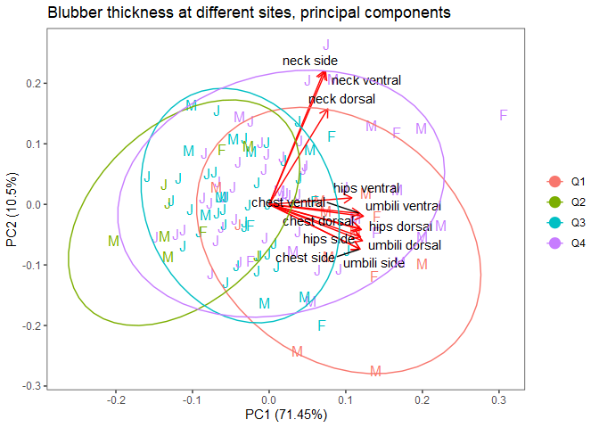

Measurement of the blubber layer at different sites in Baltic grey seals
================

This repository contains code for reproducing figures and tables.

``` r
library(tidyverse)
library(ggfortify)
library(broom)
library(broom.mixed)
source("R/functions.R")
```

### Table 1

``` r
read_blubber() %>% 
  select(group, quarter) %>% 
  table() %>% 
  knitr::kable()
```

|          |  Q1 |  Q2 |  Q3 |  Q4 |
|:---------|----:|----:|----:|----:|
| juvenile |   3 |   3 |  34 |  34 |
| female   |   3 |   2 |   4 |   4 |
| male     |  10 |   4 |  10 |  12 |

### Figure 2

``` r
read_blubber() %>% 
  longer_blubber() %>% 
  group_by(accnr, pos1, quarter, group) %>% 
  summarise(value = mean(value), .groups = "drop") %>% 
  ggplot(aes(x = pos1, y = value, color = quarter)) + 
  geom_path(aes(group = accnr), alpha = .5) +
  geom_point(alpha = .5) + 
  theme_bw() +
  facet_wrap(~group) +
  theme(legend.position = "top", axis.text.x = element_text(angle = 45, hjust = 1)) +
  labs(color = "Quarter", x = "", y = "Blubber thickness (mm)")
```

<!-- -->

### Figure 3

``` r
read_blubber() %>% 
  select(starts_with("blubber"), BMI, CI, WI) %>% 
  rename_with(~str_remove(.x, "blubber_") %>% str_replace("_", " ")) %>% 
  na.omit() %>% 
  cor() %>% 
  ggcorrplot::ggcorrplot(lab = TRUE, digits = 1, lab_size = 3, show.legend = FALSE, tl.cex = 10)
```

<!-- -->

### Mixed model fitting

``` r
mixed_data <-  read_blubber() %>% 
  longer_blubber() %>% 
  mutate(pos1 = fct_relevel(pos1, "chest", "neck", "umbili", "hips"), 
         pos2 = fct_relevel(pos2, c("ventral", "dorsal", "side")),
         body_length = body_length - 150) %>% 
  filter(pos1 != "neck") %>% 
  select(id = accnr, blubber = value, pos1, pos2, quarter, group, body_length)
glimpse(mixed_data)
```

    ## Rows: 1,100
    ## Columns: 7
    ## $ id          <chr> "A2010/05214", "A2010/05214", "A2010/05214", "A2010/05214"~
    ## $ blubber     <dbl> 29, 29, 39, 37, 29, 41, 35, 30, 33, 25, 15, 18, 20, 15, 18~
    ## $ pos1        <fct> chest, chest, chest, umbili, umbili, umbili, hips, hips, h~
    ## $ pos2        <fct> ventral, side, dorsal, ventral, side, dorsal, ventral, sid~
    ## $ quarter     <fct> Q1, Q1, Q1, Q1, Q1, Q1, Q1, Q1, Q1, Q2, Q2, Q2, Q2, Q2, Q2~
    ## $ group       <fct> juvenile, juvenile, juvenile, juvenile, juvenile, juvenile~
    ## $ body_length <dbl> -22, -22, -22, -22, -22, -22, -22, -22, -22, -7, -7, -7, -~

``` r
mixed_fit <- nlme::lme(log(blubber)~ pos1 + pos2 + quarter + body_length + group, random = ~1|id, 
                       data = mixed_data)
summary(mixed_fit)
```

    ## Linear mixed-effects model fit by REML
    ##   Data: mixed_data 
    ##         AIC       BIC   logLik
    ##   -824.0717 -759.1625 425.0359
    ## 
    ## Random effects:
    ##  Formula: ~1 | id
    ##         (Intercept)  Residual
    ## StdDev:   0.2272516 0.1334395
    ## 
    ## Fixed effects:  log(blubber) ~ pos1 + pos2 + quarter + body_length + group 
    ##                 Value  Std.Error  DF  t-value p-value
    ## (Intercept)  3.446493 0.06986692 973 49.32940  0.0000
    ## pos1umbili   0.016432 0.00985823 973  1.66680  0.0959
    ## pos1hips    -0.082071 0.00985823 973 -8.32514  0.0000
    ## pos2dorsal   0.082196 0.00986974 973  8.32807  0.0000
    ## pos2side     0.010464 0.00986216 973  1.06107  0.2889
    ## quarterQ2   -0.608109 0.09873808 116 -6.15881  0.0000
    ## quarterQ3   -0.261889 0.07109512 116 -3.68364  0.0004
    ## quarterQ4   -0.075082 0.07045585 116 -1.06565  0.2888
    ## body_length  0.003869 0.00194376 116  1.99033  0.0489
    ## groupfemale  0.282438 0.08205704 116  3.44197  0.0008
    ## groupmale    0.038200 0.08481099 116  0.45042  0.6532
    ##  Correlation: 
    ##             (Intr) ps1mbl ps1hps ps2drs pos2sd qrtrQ2 qrtrQ3 qrtrQ4 bdy_ln
    ## pos1umbili  -0.071                                                        
    ## pos1hips    -0.071  0.501                                                 
    ## pos2dorsal  -0.070 -0.002 -0.002                                          
    ## pos2side    -0.070  0.000  0.000  0.499                                   
    ## quarterQ2   -0.545  0.000  0.000  0.000  0.001                            
    ## quarterQ3   -0.858  0.000  0.000  0.001  0.001  0.505                     
    ## quarterQ4   -0.862  0.000  0.000 -0.001  0.000  0.518  0.780              
    ## body_length -0.107  0.000  0.000  0.004  0.004  0.193  0.012  0.064       
    ## groupfemale -0.227  0.000  0.000 -0.003 -0.002 -0.093  0.158  0.132 -0.487
    ## groupmale   -0.213  0.000  0.000 -0.004 -0.004 -0.105  0.183  0.130 -0.805
    ##             grpfml
    ## pos1umbili        
    ## pos1hips          
    ## pos2dorsal        
    ## pos2side          
    ## quarterQ2         
    ## quarterQ3         
    ## quarterQ4         
    ## body_length       
    ## groupfemale       
    ## groupmale    0.538
    ## 
    ## Standardized Within-Group Residuals:
    ##         Min          Q1         Med          Q3         Max 
    ## -5.42653766 -0.54999449  0.03951418  0.60616056  3.28971616 
    ## 
    ## Number of Observations: 1100
    ## Number of Groups: 123

### Table 2

``` r
estimates <- broom::tidy(mixed_fit, parametric = TRUE)

position_long <- estimates %>% 
  filter(str_detect(term, "pos1")) %>% 
  select(term, estimate) %>% 
  bind_rows(tibble(term = "pos1chest", estimate = 0)) %>% 
  mutate(factor = exp(estimate), 
         term = str_remove(term, "pos1")) %>% 
  arrange(term)

conversion_table(position_long) %>% 
  knitr::kable(digits = 3)
```

| Name   | chest |  hips | umbili |
|:-------|------:|------:|-------:|
| chest  | 1.000 | 1.086 |  0.984 |
| hips   | 0.921 | 1.000 |  0.906 |
| umbili | 1.017 | 1.104 |  1.000 |

### Table 3

``` r
position_circ <- estimates %>% 
  filter(str_detect(term, "pos2")) %>% 
  select(term, estimate) %>% 
  bind_rows(tibble(term = "pos2ventral", estimate = 0)) %>% 
  mutate(factor = exp(estimate), 
         term = str_remove(term, "pos2")) %>% 
  arrange(term)

conversion_table(position_circ) %>% 
  knitr::kable(digits = 3)
```

| Name    | dorsal |  side | ventral |
|:--------|-------:|------:|--------:|
| dorsal  |  1.000 | 1.074 |   1.086 |
| side    |  0.931 | 1.000 |   1.011 |
| ventral |  0.921 | 0.990 |   1.000 |

### Table 4

``` r
broom.mixed::tidy(mixed_fit, conf.int = TRUE) %>% 
  mutate(term = str_replace(term, "pos1", "Long. "),
         term = str_replace(term, "pos2", "Circ. "),
         term = str_replace(term, "quarterQ", "Quarter "),
         term = str_replace(term, "group", "Group "),
         term = str_replace(term, "sd_\\(Intercept\\)", "Sd (rand. eff.)"),
         term = str_replace(term, "sd_Observation", "Sd (resid.)"),
         term = str_replace(term, "_", " ")) %>% 
  select(-effect, -group) %>% 
  knitr::kable(digits = 3)
```

| term            | estimate | std.error |  df | statistic | p.value | conf.low | conf.high |
|:----------------|---------:|----------:|----:|----------:|--------:|---------:|----------:|
| (Intercept)     |    3.446 |     0.070 | 973 |    49.329 |   0.000 |    3.309 |     3.584 |
| Long. umbili    |    0.016 |     0.010 | 973 |     1.667 |   0.096 |   -0.003 |     0.036 |
| Long. hips      |   -0.082 |     0.010 | 973 |    -8.325 |   0.000 |   -0.101 |    -0.063 |
| Circ. dorsal    |    0.082 |     0.010 | 973 |     8.328 |   0.000 |    0.063 |     0.102 |
| Circ. side      |    0.010 |     0.010 | 973 |     1.061 |   0.289 |   -0.009 |     0.030 |
| Quarter 2       |   -0.608 |     0.099 | 116 |    -6.159 |   0.000 |   -0.804 |    -0.413 |
| Quarter 3       |   -0.262 |     0.071 | 116 |    -3.684 |   0.000 |   -0.403 |    -0.121 |
| Quarter 4       |   -0.075 |     0.070 | 116 |    -1.066 |   0.289 |   -0.215 |     0.064 |
| body length     |    0.004 |     0.002 | 116 |     1.990 |   0.049 |    0.000 |     0.008 |
| Group female    |    0.282 |     0.082 | 116 |     3.442 |   0.001 |    0.120 |     0.445 |
| Group male      |    0.038 |     0.085 | 116 |     0.450 |   0.653 |   -0.130 |     0.206 |
| Sd (rand. eff.) |    0.227 |        NA |  NA |        NA |      NA |    0.199 |     0.260 |
| Sd (resid.)     |    0.133 |        NA |  NA |        NA |      NA |       NA |        NA |

### Skin thickness fit and Table 5

``` r
skin_fit <- lm(log(skin_chest_mm) ~ body_length, data = read_skin())
summary(skin_fit)
```

    ## 
    ## Call:
    ## lm(formula = log(skin_chest_mm) ~ body_length, data = read_skin())
    ## 
    ## Residuals:
    ##      Min       1Q   Median       3Q      Max 
    ## -0.12927 -0.07807 -0.03031  0.08064  0.21095 
    ## 
    ## Coefficients:
    ##              Estimate Std. Error t value Pr(>|t|)    
    ## (Intercept) -1.515943   0.178299  -8.502 4.49e-08 ***
    ## body_length  0.013836   0.001015  13.636 1.38e-11 ***
    ## ---
    ## Signif. codes:  0 '***' 0.001 '**' 0.01 '*' 0.05 '.' 0.1 ' ' 1
    ## 
    ## Residual standard error: 0.09891 on 20 degrees of freedom
    ## Multiple R-squared:  0.9029, Adjusted R-squared:  0.898 
    ## F-statistic: 185.9 on 1 and 20 DF,  p-value: 1.378e-11

``` r
skin_fit %>%  broom::tidy(conf.int = TRUE) %>% 
  knitr::kable(digits = 3)
```

| term         | estimate | std.error | statistic | p.value | conf.low | conf.high |
|:-------------|---------:|----------:|----------:|--------:|---------:|----------:|
| (Intercept)  |   -1.516 |     0.178 |    -8.502 |       0 |   -1.888 |    -1.144 |
| body\_length |    0.014 |     0.001 |    13.636 |       0 |    0.012 |     0.016 |

### Figure S1

``` r
pca_data <- read_blubber() %>% 
  select(starts_with("blubber"), quarter, group) %>% na.omit() %>% 
  rename_with(~str_remove(.x, "blubber_") %>% str_replace("_", " "))

prcomp(pca_data %>% select(-quarter, -group), 
       scale = TRUE, center = TRUE) %>% 
  autoplot(label = FALSE, 
           loadings = TRUE, 
           loadings.label = TRUE, 
           loadings.label.colour = "black",
           loadings.label.repel = TRUE,
           colour = 'quarter',
           shape = "group",
           size = 4,
           data = pca_data) + 
  theme_bw() +
  theme(legend.title = element_blank(), panel.grid = element_blank()) +
  ggtitle("Blubber thickness at different sites, principal components") + 
  stat_ellipse(aes(color = quarter)) + 
  scale_shape_manual(values = c(74, 70, 77), guide = "none")
```

<!-- -->

# Figure S2

``` r
read_skin() %>% ggplot(aes(x = body_length, y = skin_chest_mm)) +
  geom_point(alpha = .5)  +
  geom_smooth(method = "glm", formula = y ~ x, 
              method.args = list(family = gaussian(link = 'log')), 
              se = FALSE, fullrange = TRUE) +
  theme_bw() + 
  xlim(c(100, 220)) + 
  labs(x = "Body length (cm)", y = "Skin chest (mm)")
```

<!-- -->
